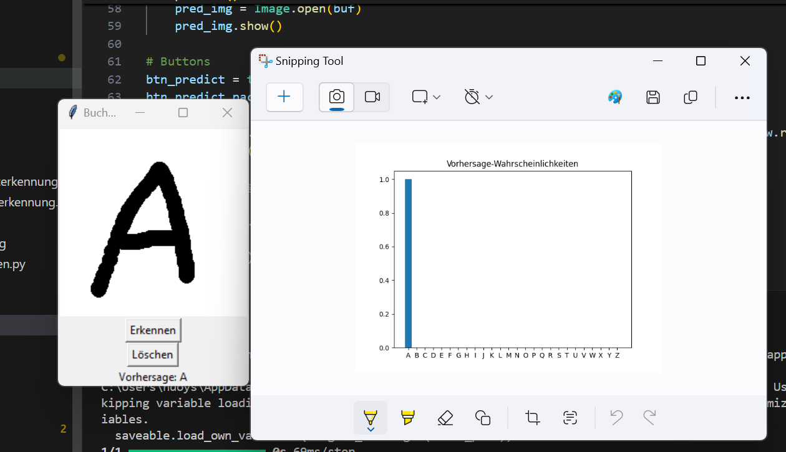
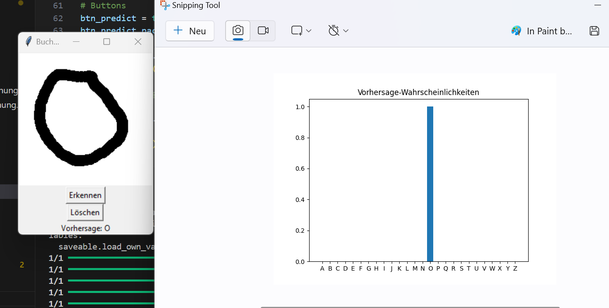
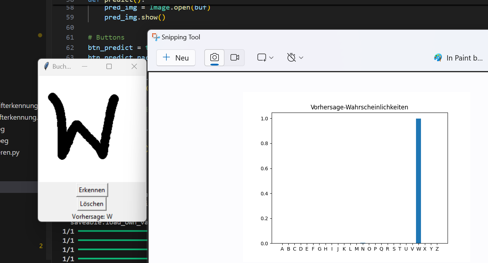

# Schrifterkennen_Doysal

# Buchstaben-Erkennung mittels KI

Dieses Projekt ermöglicht die Erkennung von handgeschriebenen Blockbuchstaben durch den Einsatz eines neuronalen Netzwerks, erstellt mit Python und TensorFlow. Die einfache Bedienung erfolgt über eine intuitive grafische Benutzeroberfläche (GUI).

## Übersicht der Vorgehensweise

1. **Datenerstellung**
    - Jeder Buchstabe des Alphabets wird per Hand in ein Raster gezeichnet.
    - Einscannen und präzises Zuschneiden erfolgt manuell mit Bildbearbeitungssoftware.
    - Ein Skript extrahiert automatisiert einzelne Buchstabenbilder.

2. **Labeling der Daten**
    - Erstellung der Label-Struktur erfolgt durch eindeutige Ordnerbezeichnung.
    - Verwendung von Ordnernamen entsprechend dem jeweiligen Buchstaben.
    - Automatisches Umbenennen der Dateien in korrekte Labels mittels eigenem Skript.

3. **Vorbereitung der Daten für das Training**
    - Alle Bilder werden auf einheitliche Größe (zwischen 25 und 50 Pixel) gebracht.
    - Pixelwerte werden normalisiert (zwischen 0 und 1 skaliert).
    - Daten werden im benötigten Format (numpy-Arrays) für TensorFlow vorbereitet.

4. **Training des Modells**
    - Trainingsdaten werden zufällig in Trainings- und Testsets aufgeteilt (90%/10%).
    - Nutzung eines sequentiellen neuronalen Netzwerks (angelehnt an das Keras Fashion-Tutorial).

5. **Validierung des Modells**
    - Testdaten dienen zur Bewertung der Genauigkeit des Modells.
    - Manuelle Prüfung der Modellvorhersagen.

6. **Speicherung des Modells**
    - Das Modell wird abschließend gespeichert und kann jederzeit erneut geladen werden.

7. **GUI zur Verwendung des Modells**
    - Mittels GUI können neue Buchstaben eingegeben und erkannt werden.
    - Ergebnis inklusive Vorhersagewahrscheinlichkeit wird anschaulich dargestellt.

## Voraussetzungen und Installation

- Python 3..12.7
- TensorFlow
- NumPy
- Pillow
- Matplotlib
- Tkinter (standardmäßig bei Python enthalten)

Installation der Bibliotheken:

```bash
pip install tensorflow numpy pillow matplotlib
```

## Nutzung der GUI

Die GUI kann mittels des folgenden Befehls gestartet werden:

```bash
python GUI.py
```

## Screenshots der lauffähigen GUI

Nachstehend einige Screenshots der grafischen Oberfläche in Aktion:

### Erkennung des Buchstaben "A"



### Erkennung des Buchstaben "O"


### Erkennung des Buchstaben "W"


## Hinweise

Stellen Sie sicher, dass das KI-Modell im selben Ordner wie die GUI liegt und der Dateipfad im GUI-Programm entsprechend angepasst wurde, um korrekte Vorhersagen zu erhalten.

